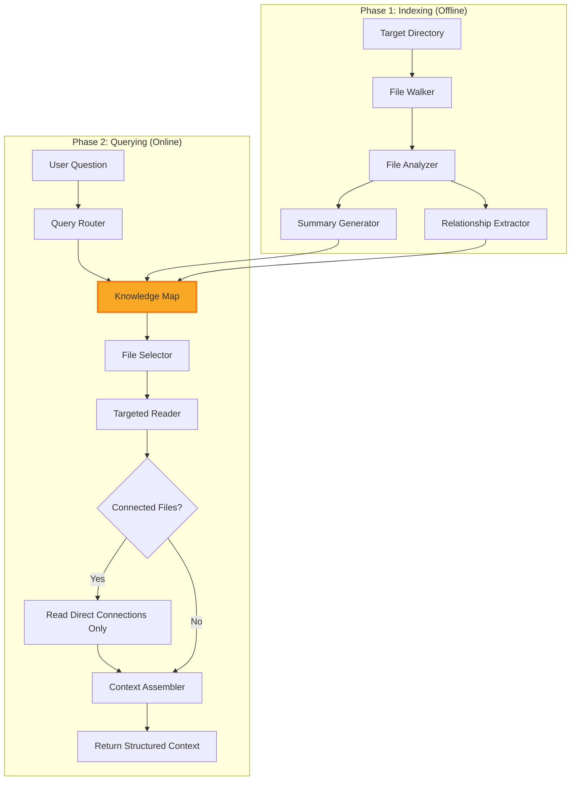
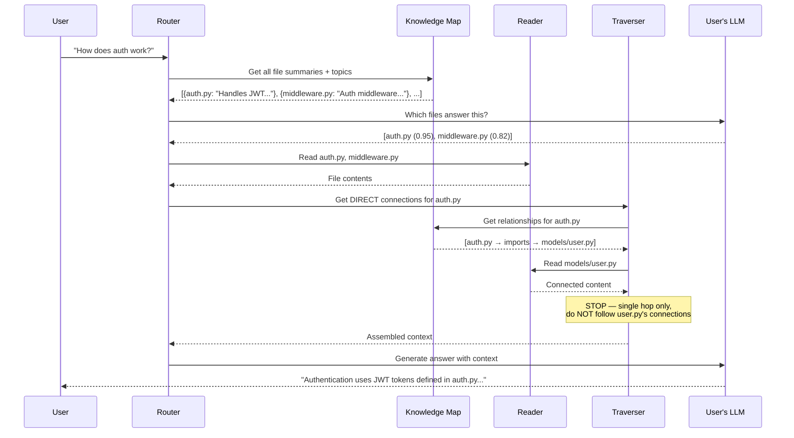

<div align="center">
  <h1>RAH — Retrieval-Augmented Hierarchy</h1>
  <p><em>A smarter, structural alternative to traditional RAG.</em></p>
</div>

<hr>

## 📖 What is RAH?

**RAH** (Retrieval-Augmented Hierarchy) is a next-generation retrieval protocol designed to overcome the critical limitations of standard chunk-based RAG systems. 

Instead of blindly shredding your documents and code into disconnected chunks and relying on token-heavy vector embeddings, RAH **maps the actual structure** of your project. It understands files, imports, configurations, and documentation, then uses intelligent LLM routing to find the exact files needed to answer a query.

---

## 🏛️ Architecture Overview

RAH operates in two distinct phases: an offline indexing phase that maps your project, and an online querying phase that traverses the map to assemble context.



---

## ⚠️ The Problem with Traditional RAG

Traditional RAG breaks all content into flat chunks and performs brute-force similarity search. This causes:
1. **Loss of structure** — File hierarchies, class definitions, and cross-references are destroyed.
2. **Context fragmentation** — Related information split across multiple chunks loses its meaning.
3. **Wasted Tokens** — Vector similarity often pulls in irrelevant chunks that just happen to share keywords.
4. **No relationship awareness** — Interconnected files (like a script and its config) are treated as isolated islands.

### How RAH Solves This:
```text
Traditional RAG: Question → Scan ALL chunks → Return top-k similar chunks → Generate answer
RAH Protocol:    Question → Consult Map → Route to best file(s) → Check single-hop connections → Generate answer
```

---

## 🔄 Query Data Flow

When a user asks a question, RAH uses your provided LLM to reason over the Knowledge Map, avoiding brute-force scans. Furthermore, it strictly uses **Single-Hop Traversal** to pull in related context without falling into infinite loops.



---

## 🛠️ Tech Stack & Design Principles

RAH is built to be fast, agnostic, and lightweight:
- **Core Language:** Pure Python (>= 3.9).
- **Zero Vector Dependencies:** No heavy vector databases (Chroma, Pinecone) or embedding models (SentenceTransformers) required.
- **Protocol First:** RAH does **not** bundle an LLM API. You inject your own LLM callable (OpenAI, Gemini, Ollama, HuggingFace).
- **Abstract Syntax Trees (AST):** Uses Python's native `ast` module to accurately map Python code structures locally.
- **Regex Engines:** Employs optimized Regex to extract imports and exports from 20+ other languages (JS, TS, Rust, Go, Java, etc.).
- **Optional Document Parsers:** Integrates with `PyMuPDF` and `python-docx` for rich document processing.

---

## 📦 Installation

Install directly from the repository using pip:

```bash
# Basic installation (Code, Markdown, JSON, YAML, etc.)
pip install .

# Installation with PDF and DOCX parsing support
pip install .[docs]
```

---

## 💻 Usage & Code Examples

RAH exposes both a Python API for integration into your apps and a CLI for rapid terminal use.

### 1. Python API

The most important concept in RAH is that **you provide the LLM**. You just need to pass a function that takes a string and returns a string.

```python
import os
from rah import RAH
import google.generativeai as genai

# 1. Setup your preferred LLM (e.g., Gemini)
genai.configure(api_key=os.environ["GEMINI_API_KEY"])
model = genai.GenerativeModel('gemini-1.5-pro')

def my_gemini_llm(prompt: str) -> str:
    """Wrapper function that RAH will use."""
    response = model.generate_content(prompt)
    return response.text

# 2. Initialize the RAH Protocol
rah = RAH(llm=my_gemini_llm)

# 3. Index your project
# This analyzes all files and creates a `.rah.json` Knowledge Map
print("Building Knowledge Map...")
knowledge_map = rah.index("/path/to/your/codebase")
print(f"Indexed {knowledge_map.total_files} files successfully!")

# 4. Ask a structural question
question = "How is the database connection established and where is the config used?"
answer = rah.ask(question)

# 5. Review the results
print("\n--- Answer ---")
print(answer.text)
print("\n--- Telemetry ---")
print(f"Primary Files Consulted: {answer.sources}")
print(f"Single-Hop Connections Read: {answer.connections}")
print(f"Router Reasoning: {answer.reasoning}")
```

### 2. Command-Line Interface (CLI)

RAH includes a CLI to easily index and query projects from your terminal. *(Note: The CLI currently uses a dummy LLM for demonstration purposes, but can be easily extended to use ENV variables).*

```bash
# Index a project directory
$ rah index /var/www/my_project
Indexing /var/www/my_project...
✅ Successfully indexed 142 files.
Map saved to /var/www/my_project/.rah.json

# Ask a question
$ rah ask "Where is the payment gateway logic?" --project /var/www/my_project
Question: Where is the payment gateway logic?
==================================================
The payment gateway logic is primarily handled in src/services/stripe.ts...
==================================================

Sources consulted:
  - src/services/stripe.ts
Connected files read (single-hop):
  - src/config/keys.ts

# View statistics of your Knowledge Map
$ rah map /var/www/my_project --stats
Project: /var/www/my_project
Total Files Indexed: 142
Total Relationships: 310
Last Updated: 2026-06-15T12:00:00.000Z
```

---

<div align="center">
  <br>
  <p>Built with ❤️ by the RAH Contributors</p>
  <p>
    <a href="https://github.com/rah-project/rah/issues">Report an Issue</a> • 
    <a href="https://github.com/rah-project/rah/pulls">Contribute</a> • 
    <a href="LICENSE">License</a>
  </p>
</div>
